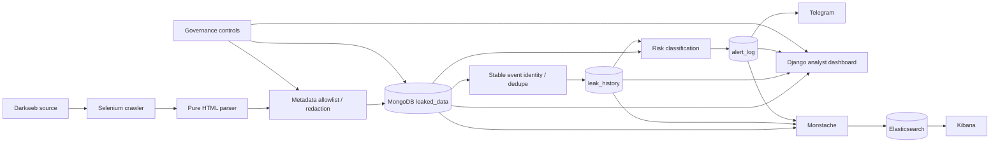

# Darkweb Threat Intelligence Monitor

다크웹 유출 게시글의 **메타데이터를 수집·정규화하고, 사건 단위로 변경을 추적해 알림·분석·운영 통제까지 연결하는 위협 인텔리전스 모니터링 프로젝트**입니다.

이 프로젝트는 실제 유출 원문 파일을 내려받거나 계정·비밀번호를 재사용하는 방식이 아니라, 공개된 게시글에서 필요한 메타데이터만 수집해 **탐지 → 중복 제거/변경 추적 → 위험도 분류 → 알림 → 분석 → 보유·접근 통제** 흐름을 재현하는 데 초점을 둡니다.

> 이 저장소의 governance 기능은 프로젝트 운영 통제 예제입니다. ISMS-P 인증 충족, 개인정보보호법 준수 판정, 법정 보유기간을 주장하지 않습니다.

## 1. 프로젝트에서 해결한 문제

초기 버전은 여러 크롤러가 각자 HTML을 읽어 MongoDB에 저장하고, Django 화면에서 결과를 보여주는 구조였습니다. 개선 과정에서는 단순 수집보다 다음 문제가 더 중요하다고 판단했습니다.

- 같은 사건을 반복 수집했을 때 중복 문서가 쌓이는 문제
- 피해 규모·설명 등이 바뀌어도 변경 이력을 남기기 어려운 문제
- 새 사건과 중요 변경을 구분하지 못해 알림 피로가 생기는 문제
- MongoDB 데이터를 분석 화면과 Elasticsearch/Kibana에 안전하게 노출하는 문제
- 더 이상 접근할 수 없는 소스를 scheduler가 계속 실행하는 문제
- 대시보드 접근, 보유기간, 감사로그 같은 운영 통제가 없는 문제

현재는 이 문제를 아래 파이프라인으로 분리해 처리합니다.



자세한 설계 판단은 [`docs/architecture.md`](docs/architecture.md), 실제 검증 근거는 [`docs/validation.md`](docs/validation.md)를 참고하세요.

## 2. 핵심 기능

### 수집과 파싱

- Selenium + Tor proxy 기반 렌더링 수집
- 크롤링, 순수 HTML 파싱, MongoDB 저장을 분리
- fixture 기반 offline parser 테스트
- raw HTML과 유출 원문 파일은 저장하지 않음
- source lifecycle registry에서 `ACTIVE` 상태만 scheduler 실행
- 현재 자동 스케줄 대상은 Bitlock 1개이며, Gunra / Black Shrantac / DragonForce parser와 fixture는 재현용으로 보존

### 사건 식별과 변경 이력

- 기존 parser `_id`는 호환성을 위해 유지
- `source + company_url`, 대체로 `source + company_name`, 마지막으로 legacy `_id`를 사용한 deterministic `event_key`
- 메타데이터 fingerprint로 동일 관찰과 변경 관찰을 구분
- `first_seen`, `last_seen`, `observation_count` 관리
- 변경 시 `leak_history`에 필드별 before/after 이력 저장
- 재시도 시 같은 변경이 중복 기록되지 않도록 deterministic history ID 사용

### 알림

- `NEW` / `UPDATED` 사건을 구분
- 중요도와 유출 내용에 따라 INFO~CRITICAL 위험도 분류
- 날짜만 바뀌는 등 비본질적 변경은 알림 억제 가능
- alert ID 기반 중복 방지
- lease / retry / attempt count로 전송 재시도와 재시작 복구 지원
- Telegram 전송 결과를 `alert_log`로 추적

### 분석 화면

- Django 기반 조회 전용 analyst dashboard
- 인증이 필요한 목록/검색/필터/상세 화면
- 위험도, source, 최근 사건, 변경 이력, 알림 상태 확인
- 로그인/로그아웃과 접근 감사 이벤트 기록
- DB URI, token, claim token, 원문 exception 같은 내부 값은 화면에 노출하지 않음

### Elasticsearch / Kibana

- Monstache를 이용해 `leaked_data`, `leak_history`, `alert_log`를 각각 별도 index로 투영
- 최초 direct read + change stream + resume state 사용
- allowlist projection으로 내부/private field 제외
- Kibana Data View 3개와 5개 패널 dashboard 제공
- 실제 Kibana에서 export한 Saved Objects NDJSON을 `elk/darkweb_day12_dashboard.ndjson`에 보관

### Security / Privacy / GRC 운영 통제

- 수집 필드 allowlist와 길이 제한
- credential/token/URL embedded credential 등 보수적 redaction
- Django 분석 화면 인증 기본 활성화
- 구조화된 로컬 audit log + rotation
- retention 기본값과 read-only 점검
- 실제 삭제는 기본 DRY RUN이며 `--apply` + DB 이름 이중 확인 필요
- source lifecycle (`ACTIVE`, `PAUSED`, `UNAVAILABLE`, `RETIRED`)
- metadata 기반 incident response playbook과 control matrix

관련 문서:

- [`governance/data_handling.md`](governance/data_handling.md)
- [`governance/incident_response.md`](governance/incident_response.md)
- [`governance/control_matrix.md`](governance/control_matrix.md)

## 3. 데이터 흐름

MongoDB의 핵심 collection은 다음과 같습니다.

| Collection | 역할 |
| --- | --- |
| `leaked_data` | 사건의 현재 상태 |
| `leak_history` | 메타데이터 변경 이력 |
| `alert_log` | NEW/UPDATED 알림의 상태·전송 이력 |
| `alert_state` | 내부 alert processing state; retention 대상 아님 |

Elasticsearch는 분석 표면을 별도로 둡니다.

| Index suffix | Mongo source | 시간 필드 |
| --- | --- | --- |
| `-events` | `leaked_data` | `last_seen` |
| `-history` | `leak_history` | `changed_at` |
| `-alerts` | `alert_log` | `created_at` |

## 4. 디렉터리 구조

```text
crawling/      crawler, parser, event identity/storage
scheduler/     ACTIVE source 주기 실행
alert/         risk policy, Telegram delivery, retry/dedupe
DjangoProject/ 정식 analyst dashboard
elk/           index mapping, setup, verification, E2E helpers
monstache/     MongoDB → Elasticsearch projection
governance/   access/data handling/retention/audit/source lifecycle
scripts/       runtime/secret/governance/ELK 운영 검사
tests/         offline regression + fixtures
```

`webapp/`은 과거 Django 복제본으로 남아 있으나, 인증 우회 진입점이 되지 않도록 fail-closed 처리했습니다. 정식 실행 진입점은 `DjangoProject/manage.py`입니다.

## 5. 실행 환경

검증에 사용한 주요 구성은 다음과 같습니다.

- Python 3.12
- Django 5.2
- MongoDB Atlas 또는 호환 MongoDB
- Chrome + Selenium
- Tor SOCKS proxy (live crawler 실행 시)
- Docker Desktop
- Elasticsearch 8.15.3
- Kibana 8.15.3
- Monstache 6.7.7
- Telegram Bot API

설치:

```powershell
python -m venv .venv
.\.venv\Scripts\Activate.ps1
python -m pip install -r requirements.txt
Copy-Item .env.example .env
```

`.env`에는 실제 credential을 직접 채우되 Git에 커밋하지 않습니다. 최소 설정 예시는 `.env.example`을 기준으로 합니다.

## 6. 기본 실행 순서

### 6.1 설정 검사

```powershell
python scripts/check_secrets.py
python scripts/check_runtime_config.py
```

### 6.2 단일 crawler 또는 scheduler

Tor가 로컬에서 준비된 뒤 현재 ACTIVE source를 직접 실행하려면:

```powershell
python -m crawling.bitlock_crawler
```

scheduler:

```powershell
python .\scheduler\scheduler.py
```

소스 상태는 `governance/sources.py`에서 수동 검토 후 변경합니다. import 또는 scheduler build 시 live availability probe를 수행하지 않습니다.

### 6.3 Django analyst dashboard

```powershell
python .\DjangoProject\manage.py migrate
python .\DjangoProject\manage.py createsuperuser
python .\DjangoProject\manage.py runserver 127.0.0.1:8000
```

브라우저에서 `http://127.0.0.1:8000/`에 접속합니다. 기본 설정에서는 미인증 사용자가 login 화면으로 이동합니다.

### 6.4 Elasticsearch / Kibana

```powershell
docker compose up -d elasticsearch kibana
python scripts/setup_elk.py --wait 120
docker compose --profile sync up -d monstache
python scripts/check_elk_pipeline.py --wait 120
```

세부 운영 절차와 안전한 정리 방법은 [`elk/operations.md`](elk/operations.md)를 참고하세요.

## 7. Governance 점검

실제 MongoDB에 대해 먼저 read-only 점검만 수행합니다.

```powershell
python scripts/check_governance.py
```

retention 대상 수만 확인하는 DRY RUN:

```powershell
python scripts/apply_retention.py
```

기본 동작에서는 문서를 삭제하지 않습니다. 실제 `--apply`는 테스트/운영 정책을 별도로 확인한 뒤에만 사용해야 합니다.

프로젝트 기본 retention 값은 다음과 같으며 **법정 보유기간이 아닙니다**.

- `leaked_data`: 365일 (`last_seen`, 없으면 `scraped_time`)
- `leak_history`: 365일 (`changed_at`)
- `alert_log`: 180일 (`updated_at`, 없으면 `created_at`)

## 8. 테스트와 검증

Offline regression:

```powershell
python -m unittest discover -v
python .\DjangoProject\manage.py test mongoDbConnect -v 2
python .\DjangoProject\manage.py check
python scripts/check_secrets.py
python scripts/check_runtime_config.py
git diff --check
```

현재 검증 기준:

- root unittest: **266 PASS**
- Django `mongoDbConnect`: **77 PASS**
- JavaScript projection reference test: **14 PASS**
- Django system check: **0 issues**
- secret/runtime/diff checks: PASS

자동 테스트만으로 완료 판정하지 않고 실제 PC에서 다음 E2E도 확인했습니다.

- MongoDB → Monstache → Elasticsearch 최초 동기화
- 실행 중 변경의 realtime 반영
- Monstache 중단 중 발생한 변경의 재시작 후 resume
- Kibana Data View 3개 / Dashboard 5개 패널 / Saved Objects export
- 실제 MongoDB governance read-only check와 retention DRY RUN
- Django 미인증 차단 → 로그인 → 조회 → 로그아웃 → 재차단
- audit log의 로그인/로그아웃/접근 이벤트

검증 시나리오와 발견된 통합 문제는 [`docs/validation.md`](docs/validation.md)에 정리했습니다.

## 9. 안전 경계와 제한사항

이 프로젝트는 다음을 하지 않습니다.

- CAPTCHA 우회
- 탈취 credential 재사용
- 피해 시스템 인증/접근 시도
- 유출 원문 파일·첨부파일 다운로드
- raw HTML 영구 저장
- source가 `UNAVAILABLE`이라는 이유만으로 위협 행위자의 실제 활동 종료를 단정
- 모든 개인정보/비밀정보를 탐지하는 완전한 DLP 기능을 주장
- retention 값을 법적 의무 기간으로 주장

또한 crawler selector는 대상 사이트 구조 변경에 영향을 받을 수 있으며, 현재 scheduler의 live source는 Bitlock 1개입니다. 나머지 parser는 offline fixture와 재현성을 위해 보존되어 있습니다.

## 10. 개선 과정에서 중요했던 설계 판단

- **중복 제거보다 identity 안정성을 우선**: 기존 parser ID는 유지하고 별도 `event_key`를 도입했습니다.
- **CVE처럼 단정하지 않고 관찰 사실을 분리**: 현재 상태와 변경 이력을 별도 collection으로 유지합니다.
- **알림은 모든 변경이 아니라 material change 중심**: 날짜만 바뀌는 등 비본질적 변경은 억제할 수 있습니다.
- **분석용 Elasticsearch에는 필요한 필드만 투영**: Mongo 내부 delivery state/private field를 제외합니다.
- **삭제는 자동화보다 안전장치를 우선**: retention은 read-only check와 DRY RUN이 기본입니다.
- **죽은 crawler를 삭제하지 않고 lifecycle로 관리**: 재현 가능한 parser/fixture는 남기되 자동 실행 대상에서 제외합니다.

이 판단들의 구체적인 배경과 trade-off는 [`docs/architecture.md`](docs/architecture.md)에 있습니다.

## 11. 프로젝트 결과

초기 크롤링 프로젝트를 단순한 "게시글 수집기"에서 다음 흐름을 가진 운영형 보안 프로젝트로 확장했습니다.

```text
수집 → 정규화 → 사건 식별 → 중복 제거 → 변경 이력
    → 위험도 분류 → 알림 → 분석 UI / ELK
    → 접근통제 / 감사 / 보유기간 / 사고대응
```

핵심은 기능 수를 늘리는 것보다 **같은 사건을 안정적으로 추적하고, 변경을 근거와 함께 남기며, 분석 표면에 필요한 데이터만 노출하고, 실제 장애/재시작 상황까지 검증한 것**입니다.
